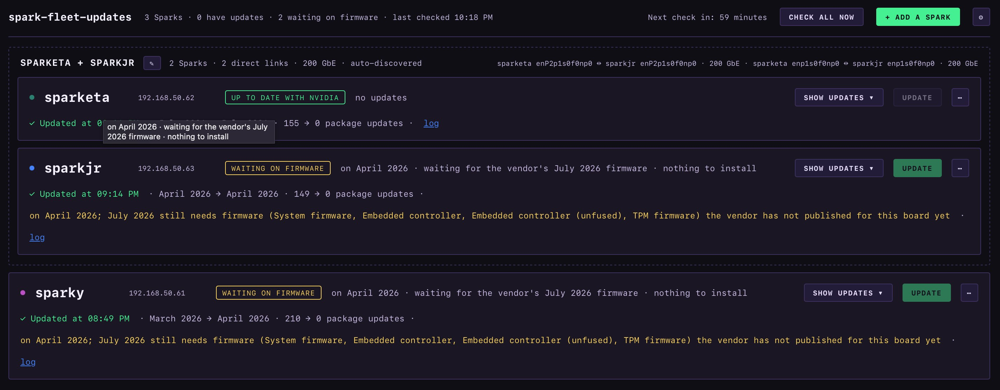

# spark-fleet-updates

One page for every NVIDIA DGX Spark you own: is there an update, what's in it,
and a button to install it.

Every Spark comes with NVIDIA's DGX Dashboard, which works for that one machine
and only from that machine. **This uses the same mechanism under the hood** —
NVIDIA's own release checker to decide whether an update is available, and the
same package and firmware commands to install it — **it just scales it up**:
all of your Sparks on a single screen you can open from any computer on your
network, updated one at a time — or, for Sparks linked into a cluster, all of
them together, one after another — while you watch.



## How it works, in plain terms

A small program runs in a container on any machine that isn't a Spark. Once an
hour it logs in to each Spark the way you would (SSH), asks the standard tools
what's installed and what updates are waiting, and works out which NVIDIA
release the Spark is on — from the same release definitions the DGX Dashboard
reads, scored the same way, and checked to give exactly the same answer as
NVIDIA's tool. Nothing is installed on the Sparks.

When you press **Update**, it runs the same commands the DGX Dashboard runs
when you click *Update Now* there, and that NVIDIA documents for updating a
Spark by hand — package updates, firmware, a restart. It shows you a
progress bar and the live log, keeps going even if you close the page, and
checks afterwards that the update actually landed. Every update is recorded,
so "what changed?" always has an answer.

**What you get**

- Each Spark on one line: **up to date**, **update available**, or **waiting
  on ASUS firmware** (or whoever built the board), with the number of updates
  and how many are security fixes. A partner-built Spark that is as current as
  its vendor has published is told apart from one that is genuinely behind:
  the page shows the software, the vendor's firmware bundle and NVIDIA's
  baseline as three separate lines, so "nothing to install" and "not on the
  latest" can both be true and both be visible.
- **Show updates** — the NVIDIA release and its notes, each firmware device
  before → after, and the full package list.
- **Update** — one button per Spark, with a confirmation first.
- Sparks cabled together over their fast network ports are **grouped
  automatically** into a cluster — two, three, or more — and pressing Update
  on any one of them updates the whole cluster, one Spark after another, so
  they always end up on the same release.
- Themes, matching [spark-dash](https://github.com/anakronox/spark-dash), the
  monitoring dashboard this project grew out of.

**What it will never do**

- Update anything on its own. You press the button, every time.
- Install software on a Spark. It only connects, asks, and — when told —
  runs the update.
- Keep your password. Like the DGX Dashboard, it asks when you press Update
  and forgets it when the update is done; it travels only over HTTPS.
- Talk to any cloud service. It needs your Sparks, and the same update
  servers they already use, and nothing else.

## Quickstart

One container on any Docker host that is not a Spark. Full guide with
prerequisites, troubleshooting and undo: [`deploy/README.md`](deploy/README.md).

```bash
git clone https://github.com/anakronox/spark-fleet-updates.git && cd spark-fleet-updates
cp .env.example .env                      # set SPARK_FLEET_SSH_USER to your login on the Sparks
mkdir -p ssh data && ssh-keygen -t ed25519 -N "" -C spark-fleet-updates -f ssh/id_ed25519
ssh-copy-id -i ssh/id_ed25519.pub user@192.0.2.11        # once per Spark …
# … and on each Spark, once, so the check can read firmware versions:
#   printf '%s ALL=(root) NOPASSWD: /usr/sbin/dmidecode -t 45, /usr/bin/mstflint -d * q\n' "$USER" | sudo tee /etc/sudoers.d/spark-fleet
sudo chown -R 1000:1000 ssh data && docker compose up -d --build
```

Open `https://<docker-host>:8080` — it serves HTTPS from the start: trust
the self-signed certificate once, give it your own, or put it behind your
reverse proxy (the guide explains which, depending on where the proxy runs).
Then **+ add a spark** by IP, and the first check runs. When you press Update you
type your password for that Spark — the same way the DGX Dashboard asks —
and it's used once, never stored. Without Docker: `python3 -m spark_fleet`
(stdlib only).

## Read more

| read | if you want to know |
|---|---|
| [`deploy/README.md`](deploy/README.md) | How to set it up, step by step, and how to undo it. |
| [`docs/architecture.md`](docs/architecture.md) | How it's built: what runs where, what happens when you press Update, and why nothing lives on the Sparks. |
| [`docs/fleet-updates.md`](docs/fleet-updates.md) | How NVIDIA's own update system works under the hood — the research this project is built on, including where NVIDIA's documentation and shipped code disagree. |
| [`NOTES.md`](NOTES.md) | Decisions, traps and findings from building it against a real three-Spark fleet. |
| [`tools/README.md`](tools/README.md) | The release checker: a re-implementation of NVIDIA's, and how to prove it still agrees with theirs. |
| [`reference/README.md`](reference/README.md) | The evidence: files copied from a Spark and command output captured from three of them, so every claim above can be checked. |

Serial numbers in the captured files are redacted; everything else is verbatim.

## Licence

MIT — see [`LICENSE`](LICENSE). NVIDIA-derived material and its licences are
listed in [`NOTICE.md`](NOTICE.md).
